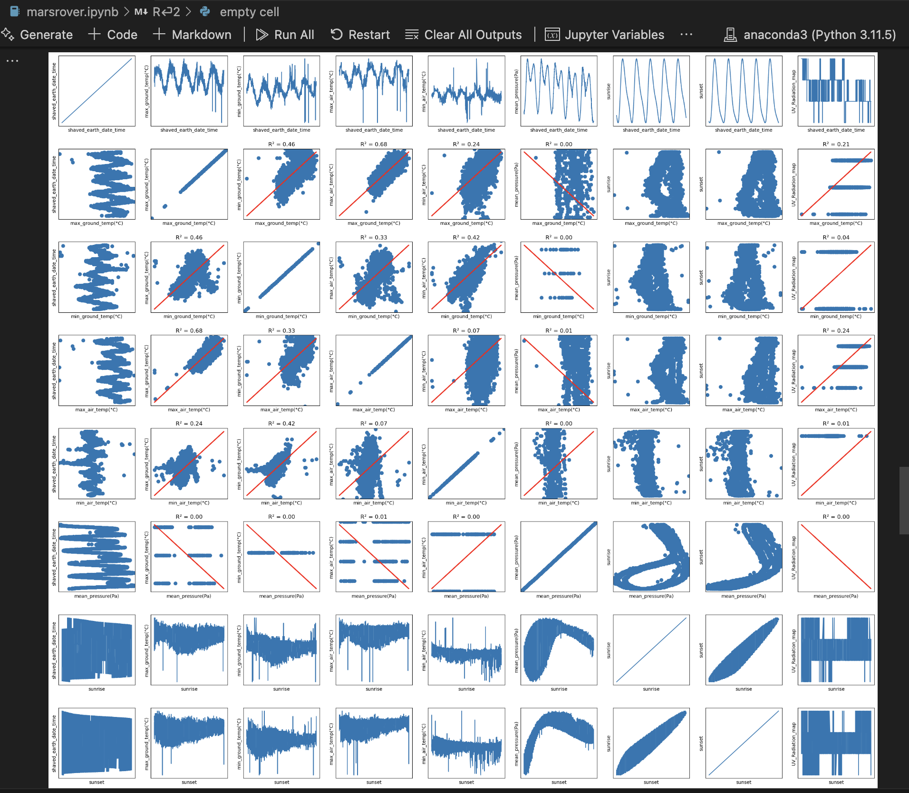
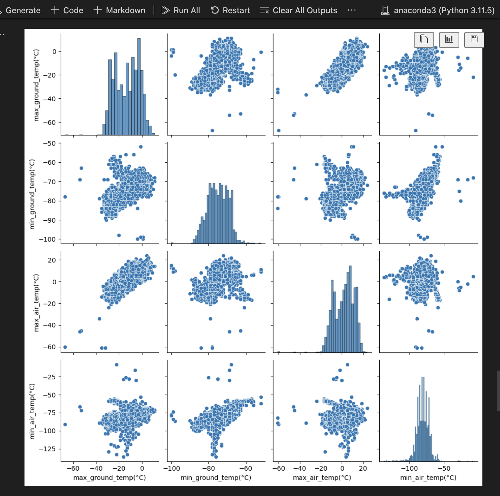

# Mars Rover Data Analysis

This project analyzes the REMS (Rover Environmental Monitoring Station) dataset from Mars. The dataset includes various environmental parameters recorded by the Mars Rover, such as temperature, pressure, and UV radiation.
 

## Project Structure

- `marsrover.ipynb`: Jupyter Notebook containing the data analysis and visualization code.
- `REMS_Mars_Dataset.csv`: CSV file containing the environmental data recorded by the Mars Rover.

## Installation

1. Clone the repository:
    ```sh
    git clone <repository-url>
    cd <repository-directory>
    ```

2. Create a virtual environment and activate it:
    ```sh
    python -m venv venv
    source venv/bin/activate  # On Windows, use `venv\Scripts\activate`
    ```

3. Install the required dependencies:
    ```sh
    pip install -r requirements.txt
    ```

## Usage

1. Open the Jupyter Notebook:
    ```sh
    jupyter notebook marsrover.ipynb
    ```

2. Run the cells in the notebook to perform data analysis and visualization.

## Data Cleaning

The dataset contains some missing values represented as "Value not available". These values are replaced with `NaN` for easier handling during analysis.

## Data Analysis

The notebook performs the following analyses:
- Conversion of date strings to datetime objects.
- Calculation of summary statistics for various environmental parameters.
- Correlation analysis between different parameters.
- Visualization of data using scatter plots and trendlines.

## Visualization

The notebook uses `matplotlib` and `seaborn` for data visualization. Various plots are generated to explore the relationships between different environmental parameters.

## License

This project is licensed under the MIT License. See the LICENSE file for details.